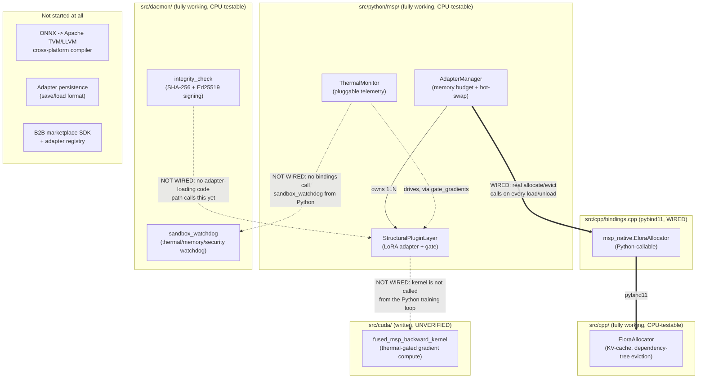

# MSP Project Status & Architecture Map

Read this first if you're new to the repo. It answers two questions:
"what actually works right now" and "how do the pieces fit together."
For *why* things were built this way (bugs found and fixed vs. the
original spec), see [`ARCHITECTURE.md`](ARCHITECTURE.md). For the threat
model, see [`SECURITY.md`](SECURITY.md).

## TL;DR status table

| Component | Status | Tested how | Notes |
|---|---|---|---|
| `StructuralPluginLayer` (Python) | Done | 12 pytest cases | Core LoRA adapter, gate, device/dtype-aware |
| `AdapterManager` (Python) | Done | 12 pytest cases | Memory-budget enforcement, hot-swap, now backed by real native allocation |
| `ThermalMonitor` (Python) | Done | 5 pytest cases | Pluggable reader, no real sensor wired in |
| `EloraAllocator` (C++) | Done | 6 cases via ctest | Portable by default; CUDA path unverified |
| `msp_native` (pybind11 binding) | Done | 5 pytest cases + ASan smoke test | Wires EloraAllocator into AdapterManager for real |
| `sandbox_watchdog` (C) | Done | 2 scenarios via ctest | Signal-based fallback; sub-ms measured latency |
| `integrity_check` (C, SHA-256 + Ed25519) | Done | Known-answer + tamper + signature round-trip tests | Signing primitive done; trust-root distribution still a deployment decision |
| CUDA kernel | Written, **not run** | Manual code review only | No GPU in this environment |
| ONNX -> TVM/LLVM pipeline | **Not started** | — | Needed for the real cross-platform story (see below) |
| Adapter persistence (save/load) | **Not started** | — | No serialization format wired up yet |
| Real hardware telemetry | **Not started** | — | Only pluggable interfaces + scripted test doubles exist |
| B2B marketplace / SDK / registry | **Not started** | — | This is Phase 3 in the v2 doc; nothing here yet |
| CI actually running on GitHub | **Unverified** | — | Workflow file is written and passes locally; not yet confirmed green in GitHub Actions |
| License | **Not chosen** | — | No `LICENSE` file yet |

## Full architecture map

How the pieces conceptually relate. Solid arrows are real, working
connections. Dashed arrows are described in the design docs but **not
implemented** — this is the most important thing for a new contributor to
notice, because it's easy to assume a diagram like this describes a
working end-to-end system, and it doesn't yet.



In words: `AdapterManager.load_adapter()` / `unload_adapter()` now perform
**real** allocation and eviction through `EloraAllocator`, via a pybind11
binding (`src/cpp/bindings.cpp` → `msp_native`), verified end-to-end (byte
counts match between the Python and native sides, eviction actually frees
native memory, budget rejection never touches the native allocator). This
is optional and gracefully degrades: if the extension hasn't been built
(no C++ toolchain, or simply not built yet), `AdapterManager` falls back
to its original pure-Python byte-tracking behavior automatically — check
`AdapterManager.native_backed` to see which mode you're in.

Still not wired: `ThermalMonitor` doesn't yet read from
`sandbox_watchdog`'s telemetry struct (they remain two independent
pluggable-reader systems, one Python one C, not sharing a data source),
and the CUDA kernel is not called from the Python training loop. See
"What's left to do" below.

## What's done

- **Python reference implementation** (`src/python/msp/`): the LoRA-style
  adapter with the dynamic gate, the memory-budgeted hot-swap manager, and
  pluggable thermal-aware gradient gating. 29 passing pytest cases,
  including regression tests for every bug fixed relative to the original
  spec (see `ARCHITECTURE.md` for the list).
- **C++ KV-cache allocator** (`src/cpp/elora_allocator.*`): adapter-scoped
  dependency-tree eviction, portable by default with an opt-in CUDA build
  path. 6 test cases, clean under AddressSanitizer + UndefinedBehaviorSanitizer.
- **Python <-> C++ binding** (`src/cpp/bindings.cpp` → `msp_native`):
  pybind11 extension wiring `EloraAllocator` into `AdapterManager`, so
  `load_adapter`/`unload_adapter` perform real allocation/eviction, not
  just Python-side byte counting. Optional and auto-detected — falls back
  to the original pure-Python behavior if the extension isn't built.
  5 dedicated pytest cases plus a standalone ASan/UBSan smoke test
  (isolated from PyTorch's own import-time allocations, which show up as
  unrelated "leaks" under ASan if you test through the full `msp` package
  import — see the binding's own verification notes for how to reproduce
  the isolated check).
- **C watchdog + integrity daemon** (`src/daemon/`): signal-based
  (not cross-thread-`longjmp`-based) fallback mechanism, measured
  sub-millisecond in this environment; SHA-256 integrity hashing with
  known-answer tests, **plus real Ed25519 signing/verification**
  (`msp_ed25519_sign` / `msp_verify_signature`) with round-trip and
  tamper-detection tests. Also clean under sanitizers.
- **Build system**: CMake for the C/C++/daemon/bindings layer (with
  `-fPIC` enabled globally so the static libs link cleanly into the
  pybind11 shared module — an actual bug caught and fixed while wiring
  this up, see "Bugs found while continuing this work" below),
  `pyproject.toml` for the Python package, a GitHub Actions workflow
  covering both (CPU-only — the CUDA path is explicitly out of scope for
  CI, since no GPU runner is configured).
- **Documentation**: this file, `ARCHITECTURE.md` (what was fixed and
  why), `SECURITY.md` (honest threat-model statement).

## Bugs found while continuing this work

Two more real bugs surfaced while building on top of the initial
implementation, beyond the ones in `ARCHITECTURE.md`:

- **Missing `-fPIC`**: linking `elora_allocator` (a static lib, compiled
  without position-independent code by CMake's default) into
  `msp_native.so` (a shared object) failed at link time with
  `relocation R_X86_64_PC32 ... can not be used when making a shared
  object`. Fixed by setting `CMAKE_POSITION_INDEPENDENT_CODE ON` globally
  in `CMakeLists.txt`.
- **Wrong import path for the compiled extension**: the pybind11 module
  is built directly into `src/python/msp/` (correct — that's where a
  compiled extension belongs inside a proper Python package), but the
  first version of `adapter_manager.py` used `import msp_native`
  (absolute/top-level) instead of `from . import msp_native` (relative),
  so it silently fell back to pure-Python mode with no error, only
  discovered by explicitly checking `AdapterManager.native_backed` after
  the "successful" build. Fixed, and now covered by
  `test_native_backend_availability_is_reported_honestly`.

## What's left to do

Roughly in the order a next contributor would probably want to tackle
them:

1. **Wire `ThermalMonitor` to `sandbox_watchdog`'s real telemetry.** The
   Python↔C++ allocator binding (above) is done; the thermal side is
   still two independent pluggable-reader systems (Python's
   `ThermalMonitor.reader` and C's `msp_telemetry_reader_fn`) that don't
   share a data source. A pybind11 binding exposing `msp_telemetry_t`
   reads would let one Python-side reader drive both.
2. **Validate the CUDA kernel on real hardware.** It's written and
   reviewed but never compiled or run. See the validation recipe in the
   comment block at the top of `fused_msp_backward_kernel.cu`
   (cross-check against `StructuralPluginLayer`'s PyTorch autograd
   gradient on a small fixed input) before trusting it.
3. **Real telemetry readers.** `ThermalMonitor` and
   `msp_telemetry_reader_fn` are interfaces with only test doubles behind
   them right now. Someone needs to write an actual reader for a target
   platform (e.g. Linux `/sys/class/thermal/thermal_zone*/temp` as a
   starting point for a dev-machine reader; real mobile targets will need
   platform-specific APIs).
4. **Adapter persistence.** There's no save/load format for adapter
   weights yet. `safetensors` is the natural choice (used by the
   HF/PEFT ecosystem this project is otherwise aligned with) but nothing
   here reads or writes it.
5. **End-to-end training example.** Everything here is unit-tested in
   isolation; there's no example wiring a `StructuralPluginLayer` into an
   actual multi-layer transformer block and running a real training loop
   against it.
6. **Trust-root decision for signature verification.** The cryptographic
   primitive is done (`msp_verify_signature`, Ed25519, tested) — what's
   left is a deployment decision about where a verifier gets a public key
   it should trust (embedded key vs. certificate chain vs. attestation
   service) and how revocation works. See `SECURITY.md`.
7. **The ONNX -> Apache TVM/LLVM cross-platform pipeline.** This is the
   architecturally-sound way (per the v2 design doc) to actually deploy
   across Apple AMX / Qualcomm Hexagon / etc. Nothing toward this exists
   yet; it needs the TVM toolchain and vendor SDKs.
8. **B2B marketplace SDK / adapter registry.** Phase 3 in the v2 doc's
   roadmap. Not started — arguably shouldn't be, until steps 1-4 above
   give you something worth registering.
9. **Housekeeping:** pick a `LICENSE`, confirm the GitHub Actions workflow
   is actually green on real GitHub infrastructure (it's only been
   validated by running the equivalent commands locally), and decide on a
   versioning/release process once there's a first real consumer of this
   package.

## How to verify this status yourself

```bash
# Install everything, including pybind11 for the native binding
pip install -r requirements.txt

# C/C++/daemon/bindings (builds msp_native.so into src/python/msp/ automatically)
cmake -B build -DCMAKE_BUILD_TYPE=Debug
cmake --build build -j
ctest --test-dir build --output-on-failure

# Python (29 tests -- 5 of these specifically exercise the native binding
# built just above; they're skipped, not failed, if you skip that step)
PYTHONPATH=src/python python -m pytest tests/python -v

# Same C/C++ tests, under AddressSanitizer + UndefinedBehaviorSanitizer
cmake -B build-asan -DCMAKE_BUILD_TYPE=Debug -DMSP_BUILD_PYTHON_BINDINGS=OFF \
  -DCMAKE_C_FLAGS="-fsanitize=address,undefined -g -fno-omit-frame-pointer" \
  -DCMAKE_CXX_FLAGS="-fsanitize=address,undefined -g -fno-omit-frame-pointer" \
  -DCMAKE_EXE_LINKER_FLAGS="-fsanitize=address,undefined"
cmake --build build-asan -j
ctest --test-dir build-asan --output-on-failure
```

Nothing in `src/cuda/` is part of these commands — there is currently no
automated way to validate it without NVIDIA GPU hardware.
