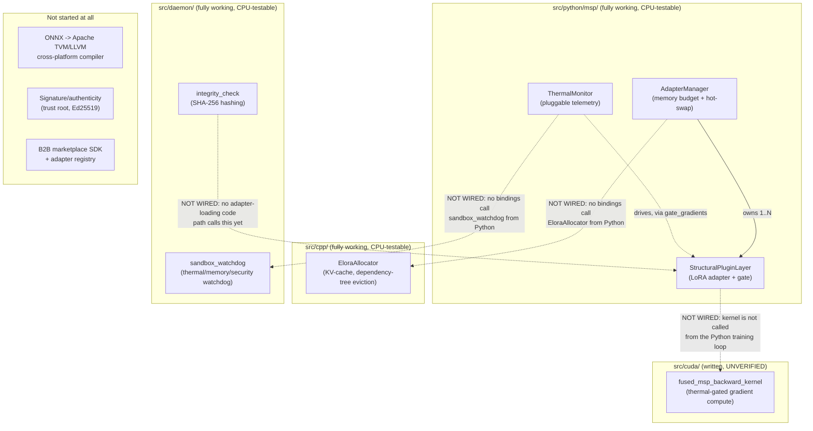

# MSP Project Status & Architecture Map

Read this first if you're new to the repo. It answers two questions:
"what actually works right now" and "how do the pieces fit together."
For *why* things were built this way (bugs found and fixed vs. the
original spec), see [`ARCHITECTURE.md`](ARCHITECTURE.md). For the threat
model, see [`SECURITY.md`](SECURITY.md).

## TL;DR status table

| Component | Status | Tested how | Notes |
|---|---|---|---|
| `StructuralPluginLayer` (Python) | Done | 12 pytest cases | Core LoRA adapter, gate, device/dtype-aware |
| `AdapterManager` (Python) | Done | 7 pytest cases | Memory-budget enforcement, hot-swap |
| `ThermalMonitor` (Python) | Done | 5 pytest cases | Pluggable reader, no real sensor wired in |
| `EloraAllocator` (C++) | Done | 6 cases via ctest | Portable by default; CUDA path unverified |
| `sandbox_watchdog` (C) | Done | 2 scenarios via ctest | Signal-based fallback; sub-ms measured latency |
| `integrity_check` (C, SHA-256) | Done | Known-answer + tamper tests | Signature/authenticity half is a stub |
| CUDA kernel | Written, **not run** | Manual code review only | No GPU in this environment |
| Python <-> C++/C bindings | **Not started** | — | Three subsystems exist independently, not wired together |
| ONNX -> TVM/LLVM pipeline | **Not started** | — | Needed for the real cross-platform story (see below) |
| Adapter signing/authenticity | **Not started** | — | Stub only, by design (needs a trust-root decision) |
| Real hardware telemetry | **Not started** | — | Only pluggable interfaces + scripted test doubles exist |
| B2B marketplace / SDK / registry | **Not started** | — | This is Phase 3 in the v2 doc; nothing here yet |
| CI actually running on GitHub | **Unverified** | — | Workflow file is written and passes locally; not yet confirmed green in GitHub Actions |
| License | **Not chosen** | — | No `LICENSE` file yet |

## Full architecture map

How the pieces conceptually relate. Solid arrows are real, working
connections. Dashed arrows are described in the design docs but **not
implemented** — this is the most important thing for a new contributor to
notice, because it's easy to assume a diagram like this describes a
working end-to-end system, and it doesn't yet.



In words: the Python layer is a complete, self-contained, tested
reference implementation. The C++ allocator and C daemon are complete,
tested, *standalone* subsystems with their own test suites. **None of
these three are called from each other yet.** A real product build needs
a binding layer (most naturally pybind11, since `EloraAllocator` is C++
and the daemon is C) so, for example, `AdapterManager.load_adapter()`
could actually reserve a KV-cache block via `EloraAllocator`, and
`ThermalMonitor` could actually read from `sandbox_watchdog`'s telemetry
struct instead of Python-side test doubles. That binding layer does not
exist yet — see "What's left to do" below.

## What's done

- **Python reference implementation** (`src/python/msp/`): the LoRA-style
  adapter with the dynamic gate, the memory-budgeted hot-swap manager, and
  pluggable thermal-aware gradient gating. 24 passing pytest cases,
  including regression tests for every bug fixed relative to the original
  spec (see `ARCHITECTURE.md` for the list).
- **C++ KV-cache allocator** (`src/cpp/elora_allocator.*`): adapter-scoped
  dependency-tree eviction, portable by default with an opt-in CUDA build
  path. 6 test cases, clean under AddressSanitizer + UndefinedBehaviorSanitizer.
- **C watchdog + integrity daemon** (`src/daemon/`): signal-based
  (not cross-thread-`longjmp`-based) fallback mechanism, measured
  sub-millisecond in this environment; SHA-256 integrity hashing with
  known-answer tests. Also clean under sanitizers.
- **Build system**: CMake for the C/C++/daemon layer, `pyproject.toml`
  for the Python package, a GitHub Actions workflow covering both
  (CPU-only — the CUDA path is explicitly out of scope for CI, since no
  GPU runner is configured).
- **Documentation**: this file, `ARCHITECTURE.md` (what was fixed and
  why), `SECURITY.md` (honest threat-model statement).

## What's left to do

Roughly in the order a next contributor would probably want to tackle
them:

1. **Wire the subsystems together.** Right now Python, C++, and C are
   three independent, tested islands. The highest-value next step is
   likely a pybind11 binding exposing `EloraAllocator` to Python so
   `AdapterManager` can call real allocation/eviction instead of just
   tracking byte counts, plus a way for `ThermalMonitor` to consume real
   telemetry from `sandbox_watchdog` (or share a reader implementation).
2. **Validate the CUDA kernel on real hardware.** It's written and
   reviewed but never compiled or run. See the validation recipe in the
   comment block at the top of `fused_msp_backward_kernel.cu`
   (cross-check against `StructuralPluginLayer`'s PyTorch autograd
   gradient on a small fixed input) before trusting it.
3. **Real telemetry readers.** `ThermalMonitor` and
   `msp_telemetry_reader_fn` are interfaces with only test doubles behind
   them right now. Someone needs to write an actual reader for a target
   platform (e.g. Linux `/sys/class/thermal/thermal_zone*/temp` as a
   starting point for a dev-machine reader; real mobile targets will need
   platform-specific APIs).
4. **Adapter persistence.** There's no save/load format for adapter
   weights yet. `safetensors` is the natural choice (used by the
   HF/PEFT ecosystem this project is otherwise aligned with) but nothing
   here reads or writes it.
5. **End-to-end training example.** Everything here is unit-tested in
   isolation; there's no example wiring a `StructuralPluginLayer` into an
   actual multi-layer transformer block and running a real training loop
   against it.
6. **Signature/authenticity.** `msp_verify_signature_STUB()` is
   deliberately unimplemented. Needs a trust-root decision (embedded
   public key vs. certificate chain vs. attestation service) before it
   can be filled in — see `SECURITY.md` for the tradeoffs.
7. **The ONNX -> Apache TVM/LLVM cross-platform pipeline.** This is the
   architecturally-sound way (per the v2 design doc) to actually deploy
   across Apple AMX / Qualcomm Hexagon / etc. Nothing toward this exists
   yet; it needs the TVM toolchain and vendor SDKs.
8. **B2B marketplace SDK / adapter registry.** Phase 3 in the v2 doc's
   roadmap. Not started — arguably shouldn't be, until steps 1-4 above
   give you something worth registering.
9. **Housekeeping:** pick a `LICENSE`, confirm the GitHub Actions workflow
   is actually green on real GitHub infrastructure (it's only been
   validated by running the equivalent commands locally), and decide on a
   versioning/release process once there's a first real consumer of this
   package.

## How to verify this status yourself

```bash
# Python (24 tests)
pip install -r requirements.txt
PYTHONPATH=src/python python -m pytest tests/python -v

# C/C++/daemon (3 test binaries via ctest)
cmake -B build -DCMAKE_BUILD_TYPE=Debug
cmake --build build -j
ctest --test-dir build --output-on-failure

# Same, under AddressSanitizer + UndefinedBehaviorSanitizer
cmake -B build-asan -DCMAKE_BUILD_TYPE=Debug \
  -DCMAKE_C_FLAGS="-fsanitize=address,undefined -g -fno-omit-frame-pointer" \
  -DCMAKE_CXX_FLAGS="-fsanitize=address,undefined -g -fno-omit-frame-pointer" \
  -DCMAKE_EXE_LINKER_FLAGS="-fsanitize=address,undefined"
cmake --build build-asan -j
ctest --test-dir build-asan --output-on-failure
```

Nothing in `src/cuda/` is part of these commands — there is currently no
automated way to validate it without NVIDIA GPU hardware.
