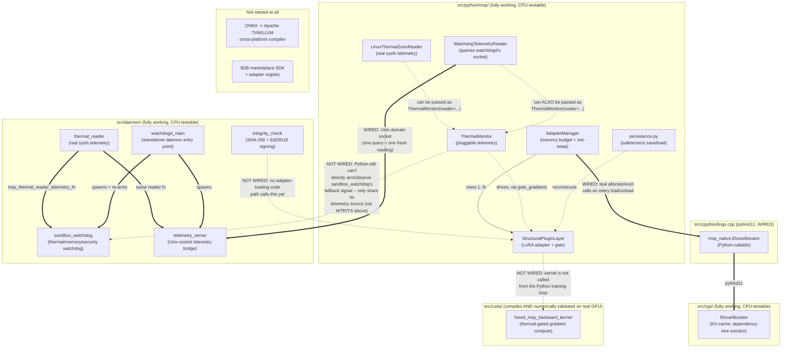

"# MSP Project Status & Architecture Map

Read this first if you're new to the repo. It answers two questions:
"what actually works right now" and "how do the pieces fit together."
For *why* things were built this way (bugs found and fixed vs. the
original spec), see [`ARCHITECTURE.md`](ARCHITECTURE.md). For the threat
model, see [`SECURITY.md`](SECURITY.md).

## TL;DR status table

| Component | Status | Tested how | Notes |
|---|---|---|---|
| `StructuralPluginLayer` (Python) | Done | 12 pytest cases | Core LoRA adapter, gate, device/dtype-aware |
| `AdapterManager` (Python) | Done | 12 pytest cases | Memory-budget enforcement, hot-swap, now backed by real native allocation |
| `ThermalMonitor` (Python) | Done | 5 pytest cases | Pluggable reader interface |
| `LinuxThermalZoneReader` (Python) | Done | 12 pytest cases | Real `/sys/class/thermal` reader; tested against a simulated sysfs tree (no real thermal zones in this dev container) |
| Adapter persistence (`msp.persistence`) | Done | 8 pytest cases | safetensors save/load, round-trip and multi-layer tested |
| `EloraAllocator` (C++) | Done | 6 cases via ctest | Portable by default; CUDA path unverified |
| `msp_native` (pybind11 binding) | Done | 5 pytest cases + ASan smoke test | Wires EloraAllocator into AdapterManager for real |
| `sandbox_watchdog` (C) | Done | 2 scenarios via ctest | Signal-based fallback; sub-ms measured latency |
| `thermal_reader` (C, real sysfs reader) | Done | 12 cases via ctest | Mirrors Python's `LinuxThermalZoneReader`; now wired as `watchdogd`'s default reader (see `watchdogd` row below) |
| `telemetry_server` (C, Unix-socket telemetry bridge) | Done | 3 cases via ctest | Serves one fresh reading per connection over a Unix domain socket, via the same reader `watchdogd`'s watchdog thread uses -- the shared data source closing the Python/C reader-agreement gap |
| `watchdogd` (C, standalone daemon `main()`) | Done | 2 pytest cases (`test_watchdogd_integration_*`) spawning the real compiled binary against a simulated sysfs tree; skipped, not failed, if the binary isn't built (same convention as the native-binding tests) | Wires `thermal_reader.c` into `sandbox_watchdog.c` and `telemetry_server.c`; re-arms and resumes after a fallback per `MSP_ARM_FALLBACK_POINT()`'s documented contract |
| `integrity_check` (C, SHA-256 + Ed25519) | Done | Known-answer + tamper + signature round-trip tests | Signing primitive done; trust-root distribution still a deployment decision |
| CUDA kernel | **Done — numerically validated on real GPU** | `nvcc` build on a Colab T4 (exit 0, 2026-07-17); numerically validated via `tests/cuda/validate_gradient_kernel.py` on a Colab T4 (2026-07-20) — PASS | Unthrottled path matches the PyTorch reference exactly; with throttling engaged, active rows match and frozen rows are confirmed untouched (sentinel check). See "CUDA validation on Google Colab" below for the captured output |
| End-to-end training example (`examples/e2e_training.py`) | **Done** | 8 pytest cases (`tests/python/test_e2e_training_example.py`) | Real multi-layer transformer, two adapters hot-swapped over one frozen base via `AdapterManager`, budget enforcement sized from real `parameter_bytes()`, thermal-gated fine-tuning, and a `msp.persistence` save/reload round trip, all exercised together instead of one piece at a time |
| ONNX -> TVM/LLVM pipeline | **Not started** | — | Needed for the real cross-platform story (see below) |
| B2B marketplace / SDK / registry | **Not started** | — | This is Phase 3 in the v2 doc; nothing here yet |
| CI running on GitHub | **Verified against a faithful local reproduction** | Full `cmake`+`ctest`+`pytest` run, matching each of the 3 workflow jobs' exact commands/flags, 2026-07-18 | A real compile bug was caught and fixed this way before it could land as a broken build (see "Bugs found while continuing this work"). Not the same as watching a green checkmark on the Actions tab itself — see note below |
| License | **Not chosen** | — | No `LICENSE` file yet |

## Full architecture map

How the pieces conceptually relate. Solid arrows are real, working
connections. Dashed arrows are described in the design docs but **not
implemented** — this is the most important thing for a new contributor to
notice, because it's easy to assume a diagram like this describes a
working end-to-end system, and it doesn't yet.



In words: `AdapterManager.load_adapter()` / `unload_adapter()` now perform
**real** allocation and eviction through `EloraAllocator`, via a pybind11
binding (`src/cpp/bindings.cpp` → `msp_native`), verified end-to-end (byte
counts match between the Python and native sides, eviction actually frees
native memory, budget rejection never touches the native allocator). This
is optional and gracefully degrades: if the extension hasn't been built
(no C++ toolchain, or simply not built yet), `AdapterManager` falls back
to its original pure-Python byte-tracking behavior automatically — check
`AdapterManager.native_backed` to see which mode you're in.

Now wired: `watchdogd` (`src/daemon/watchdogd_main.c`) is a real,
standalone daemon `main()` that constructs a `msp_watchdog_config_t` with
`thermal_reader.c`'s reader, runs it against `sandbox_watchdog.c`, and
also serves that exact same reading over a Unix domain socket
(`telemetry_server.c`) to any client. `ThermalMonitor` (Python) and the
watchdog no longer have to be two independent readers hoping to agree:
`WatchdogTelemetryReader` (`src/python/msp/thermal.py`) queries that
socket and can be passed straight into `ThermalMonitor(reader=...)`, so
both languages can watch the one real telemetry source the watchdog
itself is acting on.

Still not wired: this closes the *telemetry* gap, not a *control* gap —
Python still has no way to directly arm or observe
`sandbox_watchdog`'s own fallback signal (`MSP_ARM_FALLBACK_POINT()`/
`MSP_FALLBACK_SIGNAL` are C-side-only primitives); a Python inference
process wanting the same rollback guarantee would need its own C
extension or subprocess boundary to use them, which is a bigger, separate
piece of work (see "What's left to do" below). The CUDA kernel is also
still not called from the Python training loop.

## What's done

- **Python reference implementation** (`src/python/msp/`): the LoRA-style
  adapter with the dynamic gate, the memory-budgeted hot-swap manager, and
  pluggable thermal-aware gradient gating. 29 passing pytest cases,
  including regression tests for every bug fixed relative to the original
  spec (see `ARCHITECTURE.md` for the list).
- **C++ KV-cache allocator** (`src/cpp/elora_allocator.*`): adapter-scoped
  dependency-tree eviction, portable by default with an opt-in CUDA build
  path. 6 test cases, clean under AddressSanitizer + UndefinedBehaviorSanitizer.
- **Python <-> C++ binding** (`src/cpp/bindings.cpp` → `msp_native`):
  pybind11 extension wiring `EloraAllocator` into `AdapterManager`, so
  `load_adapter`/`unload_adapter` perform real allocation/eviction, not
  just Python-side byte counting. Optional and auto-detected — falls back
  to the original pure-Python behavior if the extension isn't built.
  5 dedicated pytest cases plus a standalone ASan/UBSan smoke test
  (isolated from PyTorch's own import-time allocations, which show up as
  unrelated "leaks" under ASan if you test through the full `msp` package
  import — see the binding's own verification notes for how to reproduce
  the isolated check).
- **C watchdog + integrity daemon** (`src/daemon/`): signal-based
  (not cross-thread-`longjmp`-based) fallback mechanism, measured
  sub-millisecond in this environment; SHA-256 integrity hashing with
  known-answer tests, **plus real Ed25519 signing/verification**
  (`msp_ed25519_sign` / `msp_verify_signature`) with round-trip and
  tamper-detection tests. Also clean under sanitizers.
- **Adapter persistence** (`src/python/msp/persistence.py`): save/load a
  set of `StructuralPluginLayer` weights to a single `.safetensors` file
  (rank, alpha, and the routing gate state are preserved as metadata
  alongside the tensors). Chosen over pickle-based `torch.save` because
  safetensors can't execute code on load -- relevant since this format is
  meant to eventually carry adapters from third-party publishers (the B2B
  marketplace use case). 8 pytest cases, including a check that a loaded
  layer produces bit-for-bit identical output to the original. Does not
  itself verify integrity/authenticity of a loaded file -- pair with
  `integrity_check.c`'s functions (via a future Python binding) for
  untrusted sources.
- **Real Linux thermal telemetry reader, both languages now**:
  `LinuxThermalZoneReader` (`src/python/msp/thermal.py`) and
  `thermal_reader.c`/`.h` (`src/daemon/`) both read real
  `/sys/class/thermal/thermal_zone*/temp` values (converting the kernel's
  millidegree-Celsius units), with zone-type filtering (e.g. only "cpu"
  zones) and a choice of max/mean aggregation across zones. This
  container has no real thermal zones to read, so both are tested against
  a simulated sysfs directory tree built in the test itself (12 pytest
  cases for the Python side, 12 ctest cases for the C side, deliberately
  mirroring the same scenarios) -- the parsing/aggregation/error-path
  logic is fully exercised on both; what's NOT exercised by either is
  reading actual hardware, which needs to happen on a real Linux machine.
  The C implementation is a second, independent implementation rather
  than a shared binding -- see `thermal_reader.h`'s header comment for
  why embedding a Python interpreter into the watchdog daemon was
  considered and rejected. It also documents a specific safety choice:
  a failed read reports `+INFINITY`, not `0`, so a broken sensor path can
  only ever cause the watchdog to over-trigger, never silently mask a
  real violation by looking like a cold, safe reading.
- **Build system**: CMake for the C/C++/daemon/bindings layer (with
  `-fPIC` enabled globally so the static libs link cleanly into the
  pybind11 shared module — an actual bug caught and fixed while wiring
  this up, see "Bugs found while continuing this work" below),
  `pyproject.toml` for the Python package, a GitHub Actions workflow
  covering both (CPU-only — the CUDA path is explicitly out of scope for
  CI, since no GPU runner is configured).
- **CUDA kernel compiles on real hardware and is numerically validated**:
  `fused_msp_backward_kernel.cu` was built with `nvcc` on a Colab T4 GPU
  on 2026-07-17 (`-arch=sm_75`, exit code 0 — only pre-existing, harmless
  `-Wcomment` warnings about the file's own multi-line build-instructions
  comment), confirming it's syntactically valid CUDA targeting the right
  compute capability. On 2026-07-20, `tests/cuda/validate_gradient_kernel.py`
  was actually run on a Colab T4: it compiles the kernel a second time via
  NVRTC (through `cupy`, independent of the `nvcc` build above), runs it
  against a fixed input (batch=4, in_features=16, rank=4), and diffs the
  result element-by-element against `StructuralPluginLayer`'s own PyTorch
  autograd gradient. Result: **PASS**. The unthrottled path matches the
  reference exactly; with throttling engaged, the active rows still match
  and the frozen rows are confirmed completely untouched (a sentinel value
  pre-fills `grad_A` before launch specifically so a stray write would be
  caught, not just a near-miss). Captured output is in "CUDA validation on
  Google Colab" below.
- **CI verified against a faithful local reproduction**: rather than
  trusting the workflow file's own internal consistency, every one of
  `ci.yml`'s 3 jobs was reproduced locally with the exact same
  commands/flags (installing the same dependencies, running the same
  `cmake`/`ctest`/`pytest` invocations) and all pass: 4/4 ctest cases in
  the plain build, 4/4 again under ASan+UBSan, and 45 passed + 4 correctly
  skipped (native-binding tests, which need the C++ extension the
  `python-tests` job doesn't build) out of 49 pytest cases. This caught
  and fixed a real compile bug (see "Bugs found while continuing this
  work") before it could land as a broken build. It is still not the same
  guarantee as watching an actual green checkmark on GitHub's Actions
  tab -- the runner image, available system packages, or network access
  could still differ in some way this reproduction didn't -- but it's a
  much stronger signal than "the YAML looks right."
- **Standalone watchdog daemon and shared telemetry source**
  (`src/daemon/watchdogd_main.c`, `src/daemon/telemetry_server.{h,c}`,
  `src/python/msp/thermal.py`'s `WatchdogTelemetryReader`): the daemon
  entry point that was missing (see the previous version of this file's
  "what's left to do" item 2) now exists. `watchdogd` wires
  `thermal_reader.c` into `sandbox_watchdog.c` for real, correctly
  re-arming (`MSP_ARM_FALLBACK_POINT()`) and resuming after a fallback
  rather than triggering once and stopping, and serves that same reading
  over a Unix domain socket so Python (`WatchdogTelemetryReader`, usable
  directly as `ThermalMonitor(reader=...)`) can watch the identical
  telemetry source the watchdog itself acts on, instead of a second,
  independent read of `/sys/class/thermal` that could in principle
  disagree. 3 ctest cases for `telemetry_server.c` in isolation (clean
  under ASan+UBSan too), plus 2 pytest cases
  (`test_watchdogd_integration_*`) that spawn the real compiled
  `watchdogd` binary against a simulated sysfs tree and query it over the
  actual socket — skipped, not failed, if the binary isn't built, same
  convention as the native-binding tests. Note: no current CI job both
  builds the C/daemon layer *and* runs pytest in the same job (see
  `ci.yml`), so — like the CUDA kernel's compile check — these two
  integration tests are currently verified by local build+run only, not
  by an actual GitHub Actions job; they're written to skip cleanly rather
  than silently pass 0 cases if a future CI job doesn't build `watchdogd`
  first.
- **End-to-end training example** (`examples/e2e_training.py`): the
  integration gap the previous version of this file's "what's left to
  do" item #2 flagged — every `msp` component was unit-tested in
  isolation, but nothing wired a `StructuralPluginLayer` into an actual
  multi-layer transformer block and ran a real training loop against it.
  This example builds a small real transformer (multi-head self-attention
  + feed-forward blocks, standard pre-LN residual structure) with a
  frozen base, attaches two independent rank-8 adapters to the same base
  layers, and exercises the full lifecycle for real: trains each adapter
  with a genuine forward/backward/`optimizer.step()` loop (loss goes from
  ~2.8, near the `ln(vocab_size)` random-guess baseline, to <1e-5),
  enforces `AdapterManager`'s memory budget using the adapters' own
  measured `parameter_bytes()` (not a synthetic number) so the second
  adapter is genuinely rejected until the first is evicted, gates
  gradients through a simulated hot spell via `ThermalMonitor` across the
  whole model rather than a single isolated layer, and round-trips one
  adapter through `msp.persistence.save_adapter`/`load_adapter` with a
  bit-for-bit output check afterward. 8 pytest cases in
  `tests/python/test_e2e_training_example.py`, including a regression
  check that training never touches the frozen base's parameters (a bug
  the per-layer unit tests couldn't have caught, since none of them
  build a composed model with other trainable-looking parameters
  nearby). Does not wire in the CUDA kernel or `sandbox_watchdog`'s
  control signal — see "what's left to do" below; this only gives them
  something real to eventually plug into on the Python side.
- **Documentation**: this file, `ARCHITECTURE.md` (what was fixed and
  why), `SECURITY.md` (honest threat-model statement).

## Bugs found while continuing this work

Three more real bugs surfaced while building on top of the initial
implementation, beyond the ones in `ARCHITECTURE.md`:

- **Missing `-fPIC`**: linking `elora_allocator` (a static lib, compiled
  without position-independent code by CMake's default) into
  `msp_native.so` (a shared object) failed at link time with
  `relocation R_X86_64_PC32 ... can not be used when making a shared
  object`. Fixed by setting `CMAKE_POSITION_INDEPENDENT_CODE ON` globally
  in `CMakeLists.txt`.
- **Wrong import path for the compiled extension**: the pybind11 module
  is built directly into `src/python/msp/` (correct — that's where a
  compiled extension belongs inside a proper Python package), but the
  first version of `adapter_manager.py` used `import msp_native`
  (absolute/top-level) instead of `from . import msp_native` (relative),
  so it silently fell back to pure-Python mode with no error, only
  discovered by explicitly checking `AdapterManager.native_backed` after
  the "successful" build. Fixed, and now covered by
  `test_native_backend_availability_is_reported_honestly`.
- **Missing `_XOPEN_SOURCE` before `<ftw.h>`**: `test_thermal_reader.c`
  uses `nftw()`/`FTW_DEPTH`/`FTW_PHYS` to clean up its simulated sysfs
  trees, which — unlike most POSIX functions glibc exposes by default —
  specifically need `_XOPEN_SOURCE >= 500` defined before any system
  header is included. Ad-hoc local testing while writing the file had
  been passing `-D_GNU_SOURCE` on the compiler command line, which masked
  the gap; the real `CMakeLists.txt` build (and therefore CI) compiles
  with no extra `-D` flags at all, so this would have been a real,
  reproducible compile failure (`error: 'FTW_DEPTH' undeclared`, etc.) on
  every actual build. Caught by rebuilding with CMake's exact default
  flags (`-std=gnu11`, no extra defines) rather than trusting the earlier
  ad-hoc testing, and fixed with `#define _XOPEN_SOURCE 700` at the top
  of the file, before its first `#include`.
- **Missing `numpy` dependency**: `pip install -r requirements.txt`
  followed by this file's own documented `pytest` command
  (`PYTHONPATH=src/python python -m pytest tests/python -v`) failed with
  `ModuleNotFoundError: No module named 'numpy'` on a genuinely fresh
  virtualenv — `safetensors.torch`'s `save_file`/`load_file` import numpy
  internally (to convert a tensor to an ndarray view) but neither
  `requirements.txt` nor `pyproject.toml`'s `dependencies` ever declared
  it, so it only worked in environments that happened to have numpy
  installed for some unrelated reason. Reproduced by installing exactly
  `requirements.txt` into a clean venv and nothing else; every
  `tests/python/test_persistence.py` case failed until `numpy` was added
  to both files. Since this affects `msp.persistence` at actual runtime
  (not just in tests), it's listed in `pyproject.toml`'s core
  `dependencies`, not only the `dev` extra.

## What's left to do

~~Numerically validate the CUDA kernel on real hardware~~ — **done as of
2026-07-20**, see "CUDA validation on Google Colab" below for the captured
PASS output.

~~End-to-end training example~~ — **done as of 2026-07-21**, see
`examples/e2e_training.py` and its "What's done" entry above.

Roughly in the order a next contributor would probably want to tackle the
rest:

1. **Give Python a way to participate in `sandbox_watchdog`'s own
   fallback/control signal, not just its telemetry.** `watchdogd` and
   `WatchdogTelemetryReader` now share one real telemetry source between
   C and Python (see "What's done"), but `MSP_ARM_FALLBACK_POINT()` /
   `MSP_FALLBACK_SIGNAL` are still C-only primitives — a Python inference
   process can *see* the same readings the watchdog sees, but can't yet
   *arm* the same rollback guarantee for itself without going through a C
   extension or a subprocess boundary of its own. `examples/e2e_training.py`
   now gives this something concrete to protect (a real training loop
   already reading thermal telemetry via `ThermalMonitor`), but note it's
   a *training* loop, not the *inference*-serving loop this item is
   really about — that distinction still matters for what "worth arming"
   means here.
2. **Wire the CUDA kernel into the Python training loop.**
   `fused_msp_backward_kernel.cu` is numerically validated in isolation
   (see "CUDA validation on Google Colab" below) but nothing calls it from
   `examples/e2e_training.py` or anywhere else in the Python training
   path yet — training there runs entirely through PyTorch autograd on
   CPU. Wiring it in needs a custom autograd `Function` (forward calls
   PyTorch as it does today; backward dispatches to the kernel when a
   CUDA device is available) and, ideally, a GPU-capable CI runner to test
   it automatically instead of only via the manual Colab recipe below.
3. **Trust-root decision for signature verification.** The cryptographic
   primitive is done (`msp_verify_signature`, Ed25519, tested) — what's
   left is a deployment decision about where a verifier gets a public key
   it should trust (embedded key vs. certificate chain vs. attestation
   service) and how revocation works. See `SECURITY.md`.
4. **The ONNX -> Apache TVM/LLVM cross-platform pipeline.** This is the
   architecturally-sound way (per the v2 design doc) to actually deploy
   across Apple AMX / Qualcomm Hexagon / etc. Nothing toward this exists
   yet; it needs the TVM toolchain and vendor SDKs.
5. **B2B marketplace SDK / adapter registry.** Phase 3 in the v2 doc's
   roadmap. Not started — arguably shouldn't be, until the steps above
   give you something worth registering.
6. **Housekeeping:** pick a `LICENSE` (still not chosen — the repo is
   public but, without a license file, not technically open source),
   watch an actual GitHub Actions run go green on GitHub's own
   infrastructure (everything so far has been verified via a faithful
   *local* reproduction of the same commands -- see the CI row in the
   table above for what that does and doesn't guarantee), and decide on a
   versioning/release process once there's a first real consumer of this
   package.

## CUDA validation on Google Colab

**Status: validated.** `src/cuda/fused_msp_backward_kernel.cu` compiles
cleanly on real NVIDIA hardware (confirmed 2026-07-17 on a Colab T4 —
`nvcc`, exit code 0), and as of 2026-07-20 its output has actually been
checked against a trusted reference via `tests/cuda/validate_gradient_kernel.py`,
run on a Colab T4. Captured output from that run:

```
Reading kernel from src/cuda/fused_msp_backward_kernel.cu
GPU: Tesla T4
Kernel compiled via NVRTC OK.
[no throttling]  matches PyTorch autograd reference: True
[throttling]     active rows [0, 2] match reference: True
[throttling]     frozen rows [1, 3] left untouched (sentinel intact): True

PASS: fused_msp_backward_kernel.cu matches the PyTorch reference (both throttled and unthrottled), on real GPU hardware.
```

This confirms the kernel's math and its thermal-gating logic are correct
against the same reference the Python layer itself is checked against —
not just that the file compiles. The steps below are the exact recipe
that produced this result, kept here as-is so the run can be reproduced
(e.g. after any future change to the kernel, or in a fresh Colab session
— a runtime doesn't persist between sessions):

1. Go to **colab.research.google.com** → **New notebook**.
2. **Runtime → Change runtime type → T4 GPU → Save.**
3. In the first cell, clone the repo and confirm the GPU is visible:
   ```python
   !git clone https://github.com/trinityman-hash/MSP.git
   %cd MSP
   !nvidia-smi
   ```
   `nvidia-smi` should print a T4 in its table. If it doesn't, the
   runtime type didn't actually switch to GPU — repeat step 2.
4. Compile the kernel (Colab images ship `nvcc` preinstalled) as a sanity
   check that the toolchain is present and the file is still valid CUDA:
   ```python
   !nvcc -O3 -arch=sm_75 --compiler-options -Wall \
       -c src/cuda/fused_msp_backward_kernel.cu \
       -o fused_msp_backward_kernel.o
   !echo "compiled: $?"
   ```
   (T4's compute capability is 7.5, hence `sm_75` — different from the
   `sm_80` example in the file's own header comment, which assumed an
   A100-class card.) This step alone only proves it compiles, not that
   it's correct — step 5 is the one that actually matters.
5. **Run the numeric validation.** This is the step that produced the
   captured PASS output above:
   ```python
   !pip install -q cupy-cuda12x
   !python tests/cuda/validate_gradient_kernel.py
   ```
   This compiles the kernel a second time (via NVRTC, through `cupy` —
   independent of step 4's `nvcc` build, so step 4 isn't a prerequisite
   for this to work, just a useful separate sanity check), runs it on the
   GPU against a small fixed input (batch=4, in_features=16, rank=4),
   and diffs the result element-by-element against
   `StructuralPluginLayer`'s own PyTorch autograd gradient for the same
   input — both with thermal throttling off (every row should match) and
   on (only the un-frozen rows should match, and the frozen rows must be
   provably untouched, not just close). It prints `PASS` and exits 0 only
   if every check passes; otherwise it prints the specific diffs and
   exits 1.

   If `cupy-cuda12x` fails to import after installing, check
   `!nvcc --version` for the actual CUDA toolkit version on the runtime
   and try `cupy-cuda13x` instead — the wheel has to match.

Since this needs to happen from a phone: Colab's notebook UI works in a
mobile browser exactly as the steps above describe — each `!command` goes
in its own cell, run with the ▶ button, and output/errors print directly
below the cell.

## How to verify this status yourself

```bash
# Install everything, including pybind11 for the native binding
pip install -r requirements.txt

# C/C++/daemon/bindings (builds msp_native.so into src/python/msp/ automatically)
cmake -B build -DCMAKE_BUILD_TYPE=Debug
cmake --build build -j
ctest --test-dir build --output-on-failure

# Python (59 tests -- 5 exercise the native binding, 2 exercise the real
# watchdogd binary; all 7 are skipped, not failed, if you skip the C/C++
# build step above, since both are built by it)
PYTHONPATH=src/python python -m pytest tests/python -v

# End-to-end example (trains two real adapters, saves/reloads one) --
# not part of the pytest suite above, run separately since it's meant to
# be read, not just asserted on:
PYTHONPATH=src/python python examples/e2e_training.py

# Same C/C++ tests, under AddressSanitizer + UndefinedBehaviorSanitizer
cmake -B build-asan -DCMAKE_BUILD_TYPE=Debug -DMSP_BUILD_PYTHON_BINDINGS=OFF \
  -DCMAKE_C_FLAGS="-fsanitize=address,undefined -g -fno-omit-frame-pointer" \
  -DCMAKE_CXX_FLAGS="-fsanitize=address,undefined -g -fno-omit-frame-pointer" \
  -DCMAKE_EXE_LINKER_FLAGS="-fsanitize=address,undefined"
cmake --build build-asan -j
ctest --test-dir build-asan --output-on-failure
```

Nothing in the two commands above touches `src/cuda/` — validating it
needs NVIDIA GPU hardware, which is why it has its own separate section
above (already run successfully once, 2026-07-20 — see the captured
output there). On a machine that does have a CUDA-capable GPU and
toolkit (Colab or otherwise), to re-run it yourself:

```bash
pip install cupy-cuda12x  # or cupy-cuda13x, matching your toolkit
python tests/cuda/validate_gradient_kernel.py
```
"