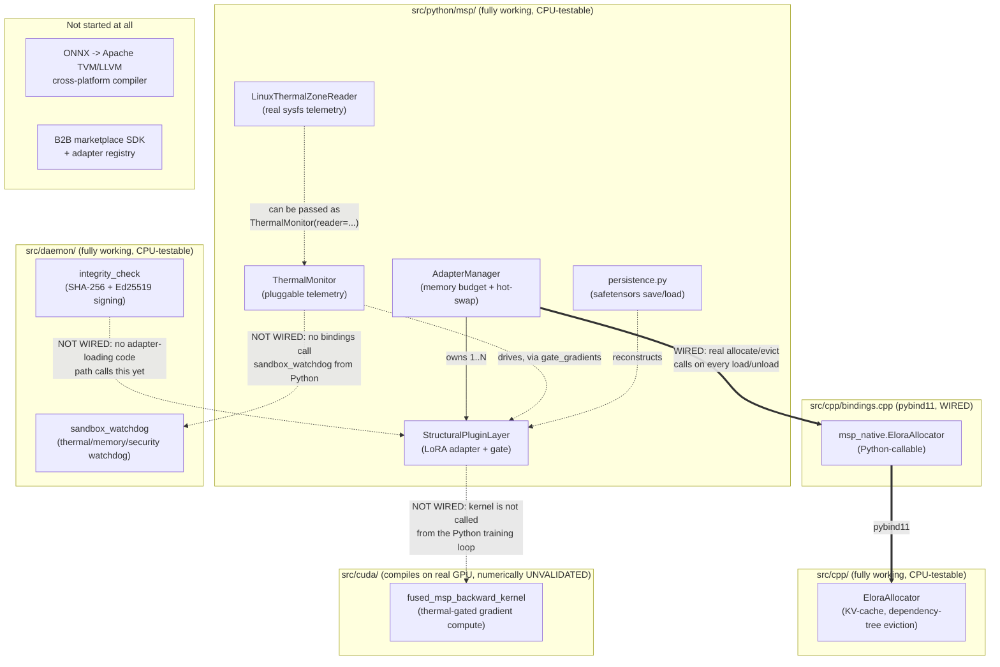

# MSP Project Status & Architecture Map

Read this first if you're new to the repo. It answers two questions:
"what actually works right now" and "how do the pieces fit together."
For *why* things were built this way (bugs found and fixed vs. the
original spec), see [`ARCHITECTURE.md`](ARCHITECTURE.md). For the threat
model, see [`SECURITY.md`](SECURITY.md).

## TL;DR status table

| Component | Status | Tested how | Notes |
|---|---|---|---|
| `StructuralPluginLayer` (Python) | Done | 12 pytest cases | Core LoRA adapter, gate, device/dtype-aware |
| `AdapterManager` (Python) | Done | 12 pytest cases | Memory-budget enforcement, hot-swap, now backed by real native allocation |
| `ThermalMonitor` (Python) | Done | 5 pytest cases | Pluggable reader interface |
| `LinuxThermalZoneReader` (Python) | Done | 12 pytest cases | Real `/sys/class/thermal` reader; tested against a simulated sysfs tree (no real thermal zones in this dev container) |
| Adapter persistence (`msp.persistence`) | Done | 8 pytest cases | safetensors save/load, round-trip and multi-layer tested |
| `EloraAllocator` (C++) | Done | 6 cases via ctest | Portable by default; CUDA path unverified |
| `msp_native` (pybind11 binding) | Done | 5 pytest cases + ASan smoke test | Wires EloraAllocator into AdapterManager for real |
| `sandbox_watchdog` (C) | Done | 2 scenarios via ctest | Signal-based fallback; sub-ms measured latency; telemetry reader still test-double only on the C side |
| `integrity_check` (C, SHA-256 + Ed25519) | Done | Known-answer + tamper + signature round-trip tests | Signing primitive done; trust-root distribution still a deployment decision |
| CUDA kernel | Compiles clean on real GPU; **numerically unvalidated** | `nvcc` build on a Colab T4 (exit 0, 2026-07-17) + manual code review | Builds, but its output has not yet been diffed against the PyTorch reference — the wrapper to do that now exists (`tests/cuda/validate_gradient_kernel.py`) but hasn't been run on a GPU yet. See "CUDA validation on Google Colab" below |
| ONNX -> TVM/LLVM pipeline | **Not started** | — | Needed for the real cross-platform story (see below) |
| B2B marketplace / SDK / registry | **Not started** | — | This is Phase 3 in the v2 doc; nothing here yet |
| CI actually running on GitHub | **Unverified** | — | Workflow file is written and passes locally; not yet confirmed green in GitHub Actions |
| License | **Not chosen** | — | No `LICENSE` file yet |

## Full architecture map

How the pieces conceptually relate. Solid arrows are real, working
connections. Dashed arrows are described in the design docs but **not
implemented** — this is the most important thing for a new contributor to
notice, because it's easy to assume a diagram like this describes a
working end-to-end system, and it doesn't yet.



In words: `AdapterManager.load_adapter()` / `unload_adapter()` now perform
**real** allocation and eviction through `EloraAllocator`, via a pybind11
binding (`src/cpp/bindings.cpp` → `msp_native`), verified end-to-end (byte
counts match between the Python and native sides, eviction actually frees
native memory, budget rejection never touches the native allocator). This
is optional and gracefully degrades: if the extension hasn't been built
(no C++ toolchain, or simply not built yet), `AdapterManager` falls back
to its original pure-Python byte-tracking behavior automatically — check
`AdapterManager.native_backed` to see which mode you're in.

Still not wired: `ThermalMonitor` doesn't yet read from
`sandbox_watchdog`'s telemetry struct (they remain two independent
pluggable-reader systems, one Python one C, not sharing a data source),
and the CUDA kernel is not called from the Python training loop. See
"What's left to do" below.

## What's done

- **Python reference implementation** (`src/python/msp/`): the LoRA-style
  adapter with the dynamic gate, the memory-budgeted hot-swap manager, and
  pluggable thermal-aware gradient gating. 29 passing pytest cases,
  including regression tests for every bug fixed relative to the original
  spec (see `ARCHITECTURE.md` for the list).
- **C++ KV-cache allocator** (`src/cpp/elora_allocator.*`): adapter-scoped
  dependency-tree eviction, portable by default with an opt-in CUDA build
  path. 6 test cases, clean under AddressSanitizer + UndefinedBehaviorSanitizer.
- **Python <-> C++ binding** (`src/cpp/bindings.cpp` → `msp_native`):
  pybind11 extension wiring `EloraAllocator` into `AdapterManager`, so
  `load_adapter`/`unload_adapter` perform real allocation/eviction, not
  just Python-side byte counting. Optional and auto-detected — falls back
  to the original pure-Python behavior if the extension isn't built.
  5 dedicated pytest cases plus a standalone ASan/UBSan smoke test
  (isolated from PyTorch's own import-time allocations, which show up as
  unrelated "leaks" under ASan if you test through the full `msp` package
  import — see the binding's own verification notes for how to reproduce
  the isolated check).
- **C watchdog + integrity daemon** (`src/daemon/`): signal-based
  (not cross-thread-`longjmp`-based) fallback mechanism, measured
  sub-millisecond in this environment; SHA-256 integrity hashing with
  known-answer tests, **plus real Ed25519 signing/verification**
  (`msp_ed25519_sign` / `msp_verify_signature`) with round-trip and
  tamper-detection tests. Also clean under sanitizers.
- **Adapter persistence** (`src/python/msp/persistence.py`): save/load a
  set of `StructuralPluginLayer` weights to a single `.safetensors` file
  (rank, alpha, and the routing gate state are preserved as metadata
  alongside the tensors). Chosen over pickle-based `torch.save` because
  safetensors can't execute code on load -- relevant since this format is
  meant to eventually carry adapters from third-party publishers (the B2B
  marketplace use case). 8 pytest cases, including a check that a loaded
  layer produces bit-for-bit identical output to the original. Does not
  itself verify integrity/authenticity of a loaded file -- pair with
  `integrity_check.c`'s functions (via a future Python binding) for
  untrusted sources.
- **Real Linux thermal telemetry reader** (`LinuxThermalZoneReader` in
  `thermal.py`): reads real `/sys/class/thermal/thermal_zone*/temp`
  values (converting the kernel's millidegree-Celsius units), with
  zone-type filtering (e.g. only "cpu" zones) and a choice of max/mean
  aggregation across zones. This container has no real thermal zones to
  read, so it's tested against a simulated sysfs directory tree built in
  the test itself (12 pytest cases) -- the parsing/aggregation/error-path
  logic is fully exercised; what's NOT exercised is reading actual
  hardware, which needs to happen on a real Linux machine. The C side
  (`msp_telemetry_reader_fn` in `sandbox_watchdog.h`) still only has a
  scripted test double, not a real reader -- see "What's left to do".
- **Build system**: CMake for the C/C++/daemon/bindings layer (with
  `-fPIC` enabled globally so the static libs link cleanly into the
  pybind11 shared module — an actual bug caught and fixed while wiring
  this up, see "Bugs found while continuing this work" below),
  `pyproject.toml` for the Python package, a GitHub Actions workflow
  covering both (CPU-only — the CUDA path is explicitly out of scope for
  CI, since no GPU runner is configured).
- **CUDA kernel compiles on real hardware**: `fused_msp_backward_kernel.cu`
  was built with `nvcc` on a Colab T4 GPU on 2026-07-17 (`-arch=sm_75`,
  exit code 0 — only pre-existing, harmless `-Wcomment` warnings about the
  file's own multi-line build-instructions comment). This confirms the
  kernel is syntactically valid CUDA and targets the right compute
  capability; it does **not** confirm the kernel's math or its
  thermal-gating logic are correct — see "CUDA validation on Google
  Colab" below for what's still missing and `tests/cuda/validate_gradient_kernel.py`
  for the wrapper that closes that gap once it's actually run.
- **Documentation**: this file, `ARCHITECTURE.md` (what was fixed and
  why), `SECURITY.md` (honest threat-model statement).

## Bugs found while continuing this work

Two more real bugs surfaced while building on top of the initial
implementation, beyond the ones in `ARCHITECTURE.md`:

- **Missing `-fPIC`**: linking `elora_allocator` (a static lib, compiled
  without position-independent code by CMake's default) into
  `msp_native.so` (a shared object) failed at link time with
  `relocation R_X86_64_PC32 ... can not be used when making a shared
  object`. Fixed by setting `CMAKE_POSITION_INDEPENDENT_CODE ON` globally
  in `CMakeLists.txt`.
- **Wrong import path for the compiled extension**: the pybind11 module
  is built directly into `src/python/msp/` (correct — that's where a
  compiled extension belongs inside a proper Python package), but the
  first version of `adapter_manager.py` used `import msp_native`
  (absolute/top-level) instead of `from . import msp_native` (relative),
  so it silently fell back to pure-Python mode with no error, only
  discovered by explicitly checking `AdapterManager.native_backed` after
  the "successful" build. Fixed, and now covered by
  `test_native_backend_availability_is_reported_honestly`.

## What's left to do

Roughly in the order a next contributor would probably want to tackle
them:

1. **Numerically validate the CUDA kernel on real hardware.** The kernel
   now compiles cleanly on a real T4 (confirmed 2026-07-17 via Colab —
   see the table above), which only proves it's syntactically valid CUDA
   for the right compute capability. It has NOT yet been run and checked
   for correctness. `tests/cuda/validate_gradient_kernel.py` is written
   and ready — it compiles the kernel via NVRTC (through `cupy`, no
   separate nvcc/ctypes link step needed) and diffs its output against a
   trusted PyTorch autograd reference, for both the unthrottled and
   thermal-gated code paths. It has not been run against a GPU yet — that
   run is the actual remaining step. See "CUDA validation on Google
   Colab" below for exact commands.
2. **Real C-side telemetry reader.** The Python side now has
   `LinuxThermalZoneReader` (real sysfs reads); the C side
   (`msp_telemetry_reader_fn` in `sandbox_watchdog.h`) still only has the
   scripted test double from `tests/daemon/test_watchdog.c`. Either port
   the same sysfs-reading logic to C, or (probably better) bind
   `LinuxThermalZoneReader` through pybind11 so both languages share one
   implementation instead of maintaining two.
3. **Wire `ThermalMonitor` to `sandbox_watchdog`'s real telemetry.** The
   Python↔C++ allocator binding is done; the thermal side is still two
   independent pluggable-reader systems (Python's `ThermalMonitor.reader`
   and C's `msp_telemetry_reader_fn`) that don't share a data source.
4. **End-to-end training example.** Everything here is unit-tested in
   isolation; there's no example wiring a `StructuralPluginLayer` into an
   actual multi-layer transformer block and running a real training loop
   against it.
5. **Trust-root decision for signature verification.** The cryptographic
   primitive is done (`msp_verify_signature`, Ed25519, tested) — what's
   left is a deployment decision about where a verifier gets a public key
   it should trust (embedded key vs. certificate chain vs. attestation
   service) and how revocation works. See `SECURITY.md`.
6. **The ONNX -> Apache TVM/LLVM cross-platform pipeline.** This is the
   architecturally-sound way (per the v2 design doc) to actually deploy
   across Apple AMX / Qualcomm Hexagon / etc. Nothing toward this exists
   yet; it needs the TVM toolchain and vendor SDKs.
7. **B2B marketplace SDK / adapter registry.** Phase 3 in the v2 doc's
   roadmap. Not started — arguably shouldn't be, until steps 1-4 above
   give you something worth registering.
8. **Housekeeping:** pick a `LICENSE`, confirm the GitHub Actions workflow
   is actually green on real GitHub infrastructure (it's only been
   validated by running the equivalent commands locally), and decide on a
   versioning/release process once there's a first real consumer of this
   package.

## CUDA validation on Google Colab

`src/cuda/fused_msp_backward_kernel.cu` compiles cleanly on real NVIDIA
hardware (confirmed 2026-07-17 on a Colab T4 — `nvcc`, exit code 0), but
its output has never been checked against a trusted reference. Compiling
only proves the syntax and compute-capability targeting are right; it
says nothing about whether the math or the thermal-gating logic actually
does what the comments say. Exact process, updated now that steps 1-4
have already been done once (repeat them for a fresh Colab session; a
runtime doesn't persist between sessions):

1. Go to **colab.research.google.com** → **New notebook**.
2. **Runtime → Change runtime type → T4 GPU → Save.**
3. In the first cell, clone the repo and confirm the GPU is visible:
   ```python
   !git clone https://github.com/trinityman-hash/MSP.git
   %cd MSP
   !nvidia-smi
   ```
   `nvidia-smi` should print a T4 in its table. If it doesn't, the
   runtime type didn't actually switch to GPU — repeat step 2.
4. Compile the kernel (Colab images ship `nvcc` preinstalled) as a sanity
   check that the toolchain is present and the file is still valid CUDA:
   ```python
   !nvcc -O3 -arch=sm_75 --compiler-options -Wall \
       -c src/cuda/fused_msp_backward_kernel.cu \
       -o fused_msp_backward_kernel.o
   !echo "compiled: $?"
   ```
   (T4's compute capability is 7.5, hence `sm_75` — different from the
   `sm_80` example in the file's own header comment, which assumed an
   A100-class card.) This step alone only proves it compiles, not that
   it's correct — step 5 is the one that actually matters.
5. **Run the numeric validation.** This is the step that was previously
   missing and is now the concrete next action:
   ```python
   !pip install -q cupy-cuda12x
   !python tests/cuda/validate_gradient_kernel.py
   ```
   This compiles the kernel a second time (via NVRTC, through `cupy` —
   independent of step 4's `nvcc` build, so step 4 isn't a prerequisite
   for this to work, just a useful separate sanity check), runs it on the
   GPU against a small fixed input (batch=4, in_features=16, rank=4),
   and diffs the result element-by-element against
   `StructuralPluginLayer`'s own PyTorch autograd gradient for the same
   input — both with thermal throttling off (every row should match) and
   on (only the un-frozen rows should match, and the frozen rows must be
   provably untouched, not just close). It prints `PASS` and exits 0 only
   if every check passes; otherwise it prints the specific diffs and
   exits 1.

   If `cupy-cuda12x` fails to import after installing, check
   `!nvcc --version` for the actual CUDA toolkit version on the runtime
   and try `cupy-cuda13x` instead — the wheel has to match.

Since this needs to happen from a phone: Colab's notebook UI works in a
mobile browser exactly as the steps above describe — each `!command` goes
in its own cell, run with the ▶ button, and output/errors print directly
below the cell.

## How to verify this status yourself

```bash
# Install everything, including pybind11 for the native binding
pip install -r requirements.txt

# C/C++/daemon/bindings (builds msp_native.so into src/python/msp/ automatically)
cmake -B build -DCMAKE_BUILD_TYPE=Debug
cmake --build build -j
ctest --test-dir build --output-on-failure

# Python (49 tests -- 5 of these specifically exercise the native binding
# built just above; they're skipped, not failed, if you skip that step)
PYTHONPATH=src/python python -m pytest tests/python -v

# Same C/C++ tests, under AddressSanitizer + UndefinedBehaviorSanitizer
cmake -B build-asan -DCMAKE_BUILD_TYPE=Debug -DMSP_BUILD_PYTHON_BINDINGS=OFF \
  -DCMAKE_C_FLAGS="-fsanitize=address,undefined -g -fno-omit-frame-pointer" \
  -DCMAKE_CXX_FLAGS="-fsanitize=address,undefined -g -fno-omit-frame-pointer" \
  -DCMAKE_EXE_LINKER_FLAGS="-fsanitize=address,undefined"
cmake --build build-asan -j
ctest --test-dir build-asan --output-on-failure
```

Nothing in the two commands above touches `src/cuda/` — there is
currently no way to validate it without NVIDIA GPU hardware, which is why
it has its own separate section above. On a machine that does have a
CUDA-capable GPU and toolkit (Colab or otherwise):

```bash
pip install cupy-cuda12x  # or cupy-cuda13x, matching your toolkit
python tests/cuda/validate_gradient_kernel.py
```
